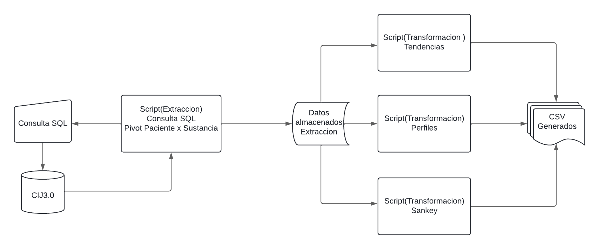
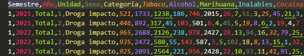
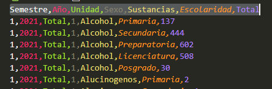

# Proyecto-CIJ
### *Introduccion*
Centros de Integración Juvenil (CIJ) es una asociación civil mexicana, no lucrativa, incorporada al Sector Salud, que cuenta con más de 50 años de experiencia en la prevención, tratamiento y rehabilitación de las conductas adictivas y otros problemas de salud mental. El proyecto se basa en crear una visualizacion (En este repositorio se encuentra la parte de backend) de reportes que contendran tendencias y perfiles asociados al consumo de sustancias tanto ilegales como legales. El desarrollo del proyecto se realizo en python.

### *Extraccion*
La extracción es la primera fase del proceso ETL (Extract, Transform, Load), que se encarga de recopilar datos de diferentes sistemas fuente, como bases de datos relacionales (RDBMS) o sistemas de archivo. En esta fase, se extraen los datos necesarios para su posterior transformación y carga en un almacén de datos de destino.
En esta parte se desarrollo la conexion a una base de datos utilizando la libreria pyodbc. Posterior a conectarse a nuestro servidor se realizo una consulta donde extraemos las tablas que necesitamos para nuestro proyecto, el problema que se presenta es que un paciente puede registrar cualquier cantidad de sustancias como haya consumida en su vida, actualmente nosotros contamos con 83 sustancias y 1 relacionada a enfermedades mentales. Tenemos una tabla que guardas los datos personales de los pacientes y otra donde guardamos los registros por sustancias, entonces al hacer el join de estas sustancias por la variable FolioId (identificador unico) se duplicaban exponencialmente los folios. Para resolver este problema se realizo un script el cual agrupa a las variables que eran diferentes y asi poder realizar un pivote seguro sin tener que perder informacion.


### *Codigo Extraccion*
#### Proceso de consulta
##### *Librerias*
```
import pyodbc
from sqlalchemy import create_engine
from dotenv import load_dotenv
import os
import pandas as pd
import warnings
import re
```
##### *Proceso de obtencion de datos DB*
```
def get_dataconn():
    """
    Descripcion:
    Funcion que crea una conexion a la base de datos de SQL Server
    Retorna:
    connection: Conexion a la base de datos de SQL Server
    """
    load_dotenv()
    server = os.getenv('DB_SERVER')
    database = os.getenv('DB_DATABASE')
    username = os.getenv('DB_USER')
    password = os.getenv('DB_PASSWORD')
    connection_string = f'DRIVER={{ODBC Driver 17 for SQL Server}};SERVER={server};DATABASE={database};UID={username};PWD={password}'
    return connection_string
```

##### *Funciones*
```
def read_consult():
    """
    Descripcion:
    Funcion que lee el archivo consult.sql y retorna el contenido del archivo
    Retorna:
    consult: Contenido del archivo consult.sql
    """
    with open ('consults/consult.sql', 'r') as file:
        consult = file.read()
    return consult

def get_dataset(connection_string):
    """
    Descripcion:
    Funcion que realiza una consulta a la base de datos de SQL Server y retorna un DataFrame con los resultados
    Retorna:
    df: DataFrame con los resultados de la consulta
    """
    try:
        conn = pyodbc.connect(connection_string)
        cursor = conn.cursor()
        query = read_consult()
        df = pd.read_sql_query(query, conn)
        return df
    except Exception as e:
        print(f'Error: {e}')
        exit()
```

#### Proceso de pivot
##### *Funciones de grupos*
```
def groupFolioSustancia(df):
    """
    Descripción:
    Esta función agrupa por FolioId y SustanciaId y regresa una lista de los valores de las columnas agrupadas. 
    Parametros:
    df: DataFrame de pandas
    Return:
    grupo: DataFrame de pandas agrupado por FolioId y SustanciaId
    """
    grupo = df.groupby(["FolioId" , "SustanciaId"]).agg(list).reset_index()
    return grupo
  
def groupFolioMotivo(df):
    """
    Descripción:
    Esta función agrupa por FolioId y MotivoConsultaId y regresa una lista de los valores de las columnas agrupadas.
    Parametros:
    df: DataFrame de pandas
    Return:
    grupo: DataFrame de pandas agrupado por FolioId y MotivoConsultaId
    """
    grupo = df.groupby(["FolioId" , "MotivoConsultaId"]).agg(list).reset_index()
    return grupo
```
##### *Proceso de modificacion*
```
def procesar (grupo , list_columns):
    """
    Descripción:
    Esta función procesa las columnas de un DataFrame de pandas agrupado por FolioId y SustanciaId o MotivoConsultaId.
    Parametros:
    grupo: DataFrame de pandas 
    list_columns: lista de columnas a procesar
    Return:
    grupo: DataFrame de pandas procesado
    """
    for i in range (0 , len(grupo.index)):
        for col in list_columns:
            if len(grupo[col][i]) > 1:
                grupo[col][i] = grupo[col][i][0]
    return grupo

def modif (grupo):
    """
    Descripción:
    Esta función modifica las columnas de un DataFrame de pandas agrupado por FolioId y SustanciaId o MotivoConsultaId.
    Parametros:
    grupo: DataFrame de pandas
    Return:
    grupo: DataFrame de pandas modificado
    """
    
    list_columns = ["EntrevistaInicialSustanciaId" , "EdadInicio" , "OrdenConsumo" , "ComunPrimeraFormaAdministracionId" , "ComunSegundaFormaAdministracionId" , "ComunTerceraFormaAdministracionId" , "ComunAbstinenciaId" , "ComunUltimoConsumoId" , "Dosis"]
    grupo_pro = procesar(grupo,list_columns)
    return grupo_pro

def modif2 (grupo):
    """
    Descripción:
    Esta función modifica las columnas de un DataFrame de pandas agrupado por FolioId y MotivoConsultaId.
    Parametros:
    grupo: DataFrame de pandas
    Return:
    grupo: DataFrame de pandas modificado
    """
    list_columns = ["MotivoConsultaId"]
    grupo_pro = procesar(grupo,list_columns)
    return grupo_pro
```
##### *Proceso de Limpieza*
```
def drop_rows (group_sep):
    """
    Descripción:
    Esta función elimina las filas duplicadas de un DataFrame de pandas agrupado por FolioId y SustanciaId.
    Parametros:
    group_sep: DataFrame de pandas
    Return:
    group_sep: DataFrame de pandas sin filas duplicadas
    """
    group_sep.drop_duplicates( subset = "FolioId" , keep = "first" , inplace = True)
    return group_sep

def piv (grupo_mod , list_columns):
    """
    Descripción:
    Esta función realiza una tabla pivote de un DataFrame de pandas agrupado por FolioId y SustanciaId.
    Parametros:
    grupo_mod: DataFrame de pandas
    list_columns: lista de columnas a procesar
    Return:
    df_complete: DataFrame de pandas con tabla pivote
    """
    
    df_complete = pd.DataFrame()
    for valor , group_sep in grupo_mod.groupby("FolioId"):
        for i in range(len(group_sep.index)):
            for col in list_columns:
                if i != 0 :
                    aux_name_col = col + str(i)
                    if aux_name_col not in group_sep.columns:
                        group_sep[aux_name_col] = np.nan
                    group_sep[aux_name_col] = group_sep[col].iloc[i]
        df_complete = pd.concat([df_complete, group_sep])
    return df_complete

def extract (x):
    """
    Descripción:
    Esta función extrae el primer elemento de una lista.
    Parametros:
    x: lista
    Return:
    x[0]: primer elemento de la lista
    """

    if isinstance(x , list):
        return x[0] if len(x) > 0 else None
    return x

def trat (df_completemerge):
    """
    Descripción:
    Esta función aplica la función extract a todas las columnas de un DataFrame de pandas.
    Parametros:
    df_completemerge: DataFrame de pandas
    """
    
    for col in df_completemerge.columns:
        df_completemerge[col] = df_completemerge[col].apply(extract)

def busqueda_Folio( df_completemerge, val_folio , ind_folio):
    """
    Descripción:
    Esta función busca el índice de un valor en una columna de un DataFrame de pandas.
    Parametros:
    df_completemerge: DataFrame de pandas
    val_folio: valor a buscar
    ind_folio: índice a buscar
    Return:
    ind: índice del valor en la columna
    """
    
    for ind , val in df_completemerge["FolioId"].items():
        if val == val_folio and ind != ind_folio:
            return ind

def AcomDa (df_completemerge , ind , ind_igual):
    """
    Descripción:
    Esta función acomoda los valores de un DataFrame de pandas.
    Parametros:
    df_completemerge: DataFrame de pandas
    ind: índice a acomodar
    ind_igual: índice a acomodar
    Return:
    df_completemerge: DataFrame de pandas acomodado
    """
    
    if ind_igual == None:
        return df_completemerge
    else:
        for col in df_completemerge.columns:
            valor_1 = df_completemerge[col].iloc[ind]
            valor_2 = df_completemerge[col].iloc[ind_igual]
            if pd.isna(valor_1) and pd.notna(valor_2):
                df_completemerge[col].iloc[ind] = valor_2
            elif pd.notna(valor_1) and pd.isna(valor_2):
                df_completemerge[col].iloc[ind_igual] = valor_1
        return df_completemerge

def limp (df_completemerge):
    """
    Descripción:
    Esta función elimina los valores duplicados de un DataFrame de pandas.
    Parametros:
    df_completemerge: DataFrame de pandas
    Return:
    df_new: DataFrame de pandas sin valores duplicados
    """
    
    for ind , val in df_completemerge["FolioId"].items():
        ind_igual = busqueda_Folio(df_completemerge , val , ind)
        df_new = AcomDa(df_completemerge , ind , ind_igual)
    df_new.drop_duplicates(inplace = True)
    return df_new
```
##### *main*
```
def main(df):
    """
    Descripción:
    Esta función aplica todas las funciones anteriores para procesar un DataFrame de pandas.
    Parametros:
    df: DataFrame de pandas
    Return:
    df_complete: DataFrame de pandas procesado
    """
    warnings.filterwarnings("ignore")
    grupo = groupFolioSustancia(df)
    grupo_mod = modif(grupo)
    list_columns = ["SustanciaId" , "EntrevistaInicialSustanciaId" , "EdadInicio" , "OrdenConsumo" , "ComunPrimeraFormaAdministracionId" , "ComunSegundaFormaAdministracionId" , "ComunTerceraFormaAdministracionId" , "ComunAbstinenciaId" , "ComunUltimoConsumoId" , "Dosis"]
    trat(grupo_mod)
    df_complete = piv(grupo_mod,list_columns)
    df_complete = limp(df_complete)
    drop_rows(df_complete)

    grupo2 = groupFolioMotivo(df)
    trat(grupo2)
    list_columns = ["MotivoConsultaId"]
    df_complete2 = piv(grupo2,list_columns)
    df_complete2 = limp(df_complete2)
    drop_rows(df_complete2)
    
    df_complete = pd.concat([df_complete, df_complete2], ignore_index=True)
    trat(df_complete)
    df_complete = limp(df_complete)
    drop_rows(df_complete)
    return df_complete

connection_string = get_dataconn()
df = get_dataset(connection_string)
df.to_csv('dataset/SQLEntrevistaInicial.csv', index = False)
warnings.filterwarnings("ignore")
df_final = pd.DataFrame()
chunksize = 100000
for chunk in pd.read_csv("dataset/SQLEntrevistaInicial.csv", chunksize = chunksize):
    df = chunk
    df = main(df)
    df_final = pd.concat([df_final, df], ignore_index = True)
df_final.to_csv('results/EntrevistaInicial.csv', index = False)
```
### *Transformacion*
La transformación es la segunda fase del proceso ETL (Extraer, Transformar, Cargar), que se encarga de modificar y preparar los datos extraídos de las fuentes para su carga en el sistema de destino. Esta fase es crítica para garantizar la calidad y consistencia de los datos.
Los datos que generamos despues de realizar el pivot es nuestra base de datos con la que generaremos nuestra informacion. Se representara la informacion de diferentes formas.
*tendencia*
*perfiles*
*sankey*
El proceso resulta en obtener los archvios csv listos para cargarse a un sistema de almacenamiento donde en este almacenamiento se generara una nueva consulta a las tablas sql y poder realizar la visualizacion en el ambiente web.

### *Tendencias*
Una tendencia es la dirección general en la que algo se mueve o cambia. En el contexto de los datos, las tendencias representan la dirección general en la que los datos están cambiando. Las tendencias pueden ser útiles para predecir eventos futuros.
En este caso se generara una tabla con las tendencias de las sustancias consumidas en los ultimos meses, la tendencia se mostrara por semestre, año, unidad, sexo, categoria, sustancias y total. 

### *Perfiles*
Un perfil es una descripción de un conjunto de datos. En el contexto de los datos, un perfil es una descripción de los datos que incluye información sobre la estructura, el contenido y la calidad de los datos. Los perfiles de datos son útiles para comprender los datos y para identificar problemas o errores en los datos.
En este caso se generaran dos perfiles uno por edad y otro por nivel escolar.
#### *Tendencia*
La grafica de tendencias la mostraremos por :
semestre(1-2), año(2021-2024), unidad(total), categoria(DrogaImpacto-DrogaUltimoMes), Sustancias (Grupos)
El resultado esperado Deberia ser una tabla como la siguiente: 


#### *Codigo*
##### *Librerias*
```
import pandas as pd
import warnings 
import unidecode 
import re
```
##### *Read data*
```
def read_data():
    '''
    Description:
    Read the data from the files and return the dataframes
    return: df, dfcc, dfc (dataframes) 
    '''
    df = pd.read_csv('results/EntrevistaInicial.csv')
    return df

def get_dict ():
    '''
    Description: Return a dictionary with the states
    return: dict_Estados (dictionary)
    '''

    dict_Mes ={1: 'Enero', 2: 'Febrero', 3: 'Marzo', 4: 'Abril', 5: 'Mayo', 6: 'Junio', 7: 'Julio', 8: 'Agosto', 9: 'Septiembre', 10: 'Octubre', 11: 'Noviembre', 12: 'Diciembre'}
    
    return dict_Mes
```

##### *Transform data*
```
def transform_data(df):
    '''
    Description: Transform the data from the dataframe
    return: df (dataframe)
    '''
    
    dict_Mes = get_dict()
    df['MesRegistro'] = df['MesRegistro'].map(dict_Mes)
    return df

def split_date(df):
    '''
    Description: Split the date in year, month and day
    return: df (dataframe)
    '''
    
    df['FechaRegistro'] = pd.to_datetime(df['FechaRegistro'])
    df['AñoRegistro'] = df['FechaRegistro'].dt.year
    df['MesRegistro'] = df['FechaRegistro'].dt.month
    df['DiaRegistro'] = df['FechaRegistro'].dt.day
    df = transform_data(df)
    return df

def sem(df , lis_1sem, lis_2sem):
    '''
    Description: Create a column with the semester
    return: df (dataframe)
    '''
    
    df['Semestre'] = 0
    for ind, val in df['MesRegistro'].items():
        if val in lis_1sem:
            df.loc[ind, 'Semestre'] = 1
        elif val in lis_2sem:
            df.loc[ind, 'Semestre'] = 2
    return df
```
##### *Grupos Sustancias*
```
def group_sust():
    '''
    Description: Create a dictionary with the substances
    return: dict_sust_inverso (dictionary)
    '''
    
    dict_sust = {'Tabaco':(1,2) , 'Alcohol':(3,4,5,84), 'Marihuana':(6,7,8,9,10,11,),'Inalables':(24,25,26,27,28) , 'Cocaina':(12,13,14,15,86) , 'Metanfetaminas': (16,17,18,19,85) , 'OtrosEstimulantes':(19,20,21,22,23), 'Extasis':(22,50,51,48), 'Benzodiacepinas': (52,53) , 'OtrosDepresores': (54,55,56), 'Alucinogenos': (29,30,31,32,33,34,35,36,37,38,39,40,41,42,43,44,45,46,47), 'Heroina': (60,61), 'OpiodesSinteticos': (62,63,64,65,66,67), 'OpioDerivados': (57,58,59), 'UtilidadMedica': (68,69,70,71,72,73,74,75), 'SustanciasDeAbuso': (76,77,78,79,80,81,82), 'Otros': (83,10000)}
    dict_sust_inverso = {}
    for sustancia, numeros in dict_sust.items():
        for numero in numeros:
            dict_sust_inverso[numero] = sustancia
    return dict_sust_inverso

def mod_sust (df):
    '''
    Description: Modify the columns MayorImpactoSustanciaId
    return: df (dataframe)
    '''
    
    dict_sust = group_sust()
    for col in df.columns:
        if col.startswith('MayorImpactoSustanciaId'):
            df[col] = df[col].map(dict_sust)
    for col in df.columns:
        if col.startswith('SustanciaI'):
            df[col] = df[col].map(dict_sust)
    return df
```
##### *Mod Data*
```
def mod_data(df):
    '''
    Description: Modify the data from the dataframe
    return: df (dataframe)
    '''
    
    df = split_date(df)
    lista_1sem = ['Enero', 'Febrero', 'Marzo', 'Abril', 'Mayo', 'Junio']
    lista_2sem = ['Julio', 'Agosto', 'Septiembre', 'Octubre', 'Noviembre', 'Diciembre']
    df = sem(df, lista_1sem, lista_2sem)
    df = mod_sust(df)
    df['Edad'] = df['Edad'].astype(str)
    df['Edad'] = df['Edad'].apply(unidecode.unidecode)
    df['Edad'] = df['Edad'].str.replace('+' , '' )
    df['Edad'] = df['Edad'].str.replace('*' , '')
    df['Edad'] = df['Edad'].str.replace('.0' , '')
    df['Edad'] = df['Edad'].replace('', '0')
    df['Edad'] = df['Edad'].astype(float)

    return df

def range_age(df):
    '''
    Description: Create a column with the age range
    return: df (dataframe)
    '''
    
    df['Edad'] = pd.cut(df['Edad'], bins=[0, 11, 20, 30, 40, 50, 60, 150], labels=['0-10', '11-20', '21-30', '31-40', '41-50', '51-60', '65+'])
    return df

def gen_valueof_column():
    '''
    Description: Create a dictionary
    return: value_to_column (dictionary)
    '''
    value_to_column = {
        'Tabaco': 'Tabaco',
        'Alcohol': 'Alcohol',
        'Marihuana': 'Marihuana',
        'Inalables': 'Inalables',
        'Cocaina': 'Cocaina',
        'Metanfetaminas': 'Metanfetaminas',
        'OtrosEstimulantes': 'OtrosEstimulantes',
        'Extasis': 'Extasis',
        'Benzodiacepinas': 'Benzodiacepinas',
        'OtrosDepresores': 'OtrosDepresores',
        'Alucinogenos': 'Alucinogenos',
        'Heroina': 'Heroina',
        'OpiodesSinteticos': 'OpiodesSinteticos',
        'OpioDerivados': 'OpioDerivados',
        'UtilidadMedica': 'UtilidadMedica',
        'SustanciasDeAbuso': 'SustanciasDeAbuso',
        'Otros': 'Otros'
    }
    return value_to_column
```
##### *Desarrollo Tendencias Droga Impacto*
```
def tendencias_MI(df):
    df_result = pd.DataFrame(columns = ['Semestre', 'Año' , 'Unidad' , 'Sexo' , 'Categoria', 'Tabaco' , 'Alcohol', 'Marihuana','Inalables', 'Cocaina' , 'Metanfetaminas', 'OtrosEstimulantes', 'Extasis', 'Benzodiacepinas', 'OtrosDepresores', 'Alucinogenos', 'Heroina', 'OpiodesSinteticos', 'OpioDerivados', 'UtilidadMedica', 'SustanciasDeAbuso', 'Otros'])
    if df_result.empty:
        df_result.loc[0] = 0    
    for col in df.columns:
        if col.startswith('MayorImpactoSustanciaId'):
            value_to_column = gen_valueof_column()
            for ind, val in df[col].items():
                if val in value_to_column:
                    df_result.loc[0, value_to_column[val]] += 1
    df_result['Semestre'][0] = df['Semestre'].iloc[0]
    df_result['Año'][0] = df['AñoRegistro'].iloc[0]
    df_result['Unidad'][0] = 'Total'
    df_result['Categoria'][0] = 'Droga impacto'
    df_result['Sexo'][0] = df['SexoId'].iloc[0]
    return df_result

def group_data(df):
    '''     
    Description: Group the data by semester
    return: df_result (dataframe)
    '''
    
    df_result = pd.DataFrame()
    for val , group in df.groupby(['Semestre', 'AñoRegistro', 'SexoId']):
        df_result = pd.concat([df_result, tendencias_MI(group)])
    return df_result
```
##### *Desarrollo Tendencias Ultimo Mes*
```
def tendencias_UM(df):
    df_result = pd.DataFrame(columns = ['Semestre', 'Año' , 'Unidad' , 'Sexo' , 'Categoria', 'Tabaco' , 'Alcohol', 'Marihuana','Inalables', 'Cocaina' , 'Metanfetaminas', 'OtrosEstimulantes', 'Extasis', 'Benzodiacepinas', 'OtrosDepresores', 'Alucinogenos', 'Heroina', 'OpiodesSinteticos', 'OpioDerivados', 'UtilidadMedica', 'SustanciasDeAbuso', 'Otros'])
    if df_result.empty:
        df_result.loc[0] = 0    
    value_to_column = gen_valueof_column()
    for col in df.columns:
        if col.startswith('SustanciaI'):
            exp = re.search(r'SustanciaId(\d+)', col)
            if exp:
                if df['ComunAbstinenciaId'+str(exp.group(1))].iloc[0] in range (1,4):
                    for ind, val in df[col].items():
                        if val in value_to_column:
                            df_result.loc[0, value_to_column[val]] += 1
    df_result['Semestre'][0] = df['Semestre'].iloc[0]
    df_result['Año'][0] = df['AñoRegistro'].iloc[0]
    df_result['Unidad'][0] = 'Total'
    df_result['Categoria'][0] = 'Droga Ultimo Mes'
    df_result['Sexo'][0] = df['SexoId'].iloc[0]
    return df_result

def group_dataUM(df):
    '''     
    Description: Group the data by semester
    return: df_result (dataframe)
    '''
    
    df_result = pd.DataFrame()
    for val , group in df.groupby(['Semestre', 'AñoRegistro', 'SexoId']):
        df_result = pd.concat([df_result, tendencias_UM(group)])
    return df_result
```
##### *Main*
```
def main ():
    '''
    Description: Main function
    '''
    df = read_data()
    df = mod_data(df)
    df = range_age(df)
    df1 = group_data(df)
    df2 = group_dataUM(df)
    create_csv(df1, df2)
```
### *Perfiles*
Se plantean dos perfiles uno por edad y otro por nivel escolar, la tabla que se propone es la siguiente
Semestre,Año,Unidad,Sexo,Sustancias,Escolaridad,Total. La tabla deberia ser parecida a lo siguiente

#### *Codigo*
##### *Librerias*
```
import pandas as pd
import warnings
import unidecode
```
##### *Read Data*
```
def read_data():
    '''
    Description:
    Read the data from the files and return the dataframes
    return: df, dfcc, dfc (dataframes) 
    '''
    df = pd.read_csv('results/EntrevistaInicial.csv')
    return df

def get_dict ():
    '''
    Description: Return a dictionary with the states
    return: dict_Estados (dictionary)
    '''

    dict_Mes ={1: 'Enero', 2: 'Febrero', 3: 'Marzo', 4: 'Abril', 5: 'Mayo', 6: 'Junio', 7: 'Julio', 8: 'Agosto', 9: 'Septiembre', 10: 'Octubre', 11: 'Noviembre', 12: 'Diciembre'}
    return dict_Mes
```
##### *Transform and split*
```
def transform_data(df):
    '''
    Description: Transform the data from the dataframe
    return: df (dataframe)
    '''
    
    dict_Mes = get_dict()
    df['MesRegistro'] = df['MesRegistro'].map(dict_Mes)
    return df

def split_date(df):
    '''
    Description: Split the date in year, month and day
    return: df (dataframe)
    '''
    
    df['FechaRegistro'] = pd.to_datetime(df['FechaRegistro'])
    df['AñoRegistro'] = df['FechaRegistro'].dt.year
    df['MesRegistro'] = df['FechaRegistro'].dt.month
    df['DiaRegistro'] = df['FechaRegistro'].dt.day
    df = transform_data(df)
    return df

def sem(df , lis_1sem, lis_2sem):
    '''
    Description: Create a column with the semester
    return: df (dataframe)
    '''
    
    df['Semestre'] = 0
    for ind, val in df['MesRegistro'].items():
        if val in lis_1sem:
            df.loc[ind, 'Semestre'] = 1
        elif val in lis_2sem:
            df.loc[ind, 'Semestre'] = 2
    return df

```
##### *Grupos*
```
def group_sust():
    '''
    Description: Create a dictionary with the substances
    return: dict_sust_inverso (dictionary)
    '''
    
    dict_sust = {'Tabaco':(1,2) , 'Alcohol':(3,4,5,84), 'Marihuana':(6,7,8,9,10,11,),'Inalables':(24,25,26,27,28) , 'Cocaina':(12,13,14,15,86) , 'Metanfetaminas': (16,17,18,19,85) , 'OtrosEstimulantes':(19,20,21,22,23), 'Extasis':(22,50,51,48), 'Benzodiacepinas': (52,53) , 'OtrosDepresores': (54,55,56), 'Alucinogenos': (29,30,31,32,33,34,35,36,37,38,39,40,41,42,43,44,45,46,47), 'Heroina': (60,61), 'OpiodesSinteticos': (62,63,64,65,66,67), 'OpioDerivados': (57,58,59), 'UtilidadMedica': (68,69,70,71,72,73,74,75), 'SustanciasDeAbuso': (76,77,78,79,80,81,82), 'Otros': (83,10000)}
    dict_sust_inverso = {}
    for sustancia, numeros in dict_sust.items():
        for numero in numeros:
            dict_sust_inverso[numero] = sustancia
    return dict_sust_inverso

def range_age(df):
    '''
    Description: Create a column with the age range
    return: df (dataframe)
    '''
    
    df['Edad'] = pd.cut(df['Edad'], bins=[0, 11, 20, 30, 40, 50, 60, 150], labels=['0-10', '11-20', '21-30', '31-40', '41-50', '51-60', '65+'])
    df['ComunEscolaridadId'] = pd.cut(df['ComunEscolaridadId'] , bins = [1,3,5,7,11,15], labels = ['Primaria', 'Secundaria', 'Preparatoria', 'Licenciatura', 'Posgrado'])
    return df

def group_data(df):
    '''     
    Description: Group the data by semester
    return: df_result (dataframe)
    '''
    
    df_result = pd.DataFrame()
    for val , group in df.groupby(['Semestre', 'AñoRegistro', 'SexoId','MayorImpactoSustanciaId','ComunEscolaridadId']):
        df_result = pd.concat([df_result, tendencias(val, group)])
    return df_result
```
##### *Mod Data*
```
def mod_sust (df):
    '''
    Description: Modify the columns MayorImpactoSustanciaId
    return: df (dataframe)
    '''
    
    dict_sust = group_sust()
    for col in df.columns:
        if col.startswith('MayorImpactoSustanciaId'):
            df[col] = df[col].map(dict_sust)
    for col in df.columns:
        if col.startswith('SustanciaI'):
            df[col] = df[col].map(dict_sust)
    return df

def mod_data(df):
    '''
    Description: Modify the data from the dataframe
    return: df (dataframe)
    '''
    
    df = split_date(df)
    lista_1sem = ['Enero', 'Febrero', 'Marzo', 'Abril', 'Mayo', 'Junio']
    lista_2sem = ['Julio', 'Agosto', 'Septiembre', 'Octubre', 'Noviembre', 'Diciembre']
    df = sem(df, lista_1sem, lista_2sem)
    df = mod_sust(df)
    df['Edad'] = df['Edad'].astype(str)
    df['Edad'] = df['Edad'].apply(unidecode.unidecode)
    df['Edad'] = df['Edad'].str.replace('+' , '' )
    df['Edad'] = df['Edad'].str.replace('*' , '')
    df['Edad'] = df['Edad'].str.replace('.0' , '')
    df['Edad'] = df['Edad'].replace('', '0')
    df['Edad'] = df['Edad'].astype(float)

    return df
```
##### *Perfil*
```
def tendencias (val2, group):
    '''
    Description: Create a dataframe with the trends
    return: df_result (dataframe)
    '''

    df_result = pd.DataFrame(columns = ['Semestre', 'Año' , 'Unidad' , 'Sexo' ,'Sustancias', 'Escolaridad' , 'Total'])
    if df_result.empty:
        df_result.loc[0] = 0
    count = 0
    for ind , val in group['MayorImpactoSustanciaId'].items():
        if val == str(val2[3]):
            count += 1
    df_result['Semestre'][0] = group['Semestre'].iloc[0]
    df_result['Año'][0] = group['AñoRegistro'].iloc[0]
    df_result['Unidad'][0] = 'Total'
    df_result['Sexo'][0] = group['SexoId'].iloc[0]
    df_result['Escolaridad'][0] = group['ComunEscolaridadId'].iloc[0]
    df_result['Sustancias'][0] = val2[3]
    df_result['Total'][0] = count
    return df_result
```
##### *Main*
```
def main ():
    '''
    Description: Main function
    '''
    df = read_data()
    df = mod_data(df)
    df = range_age(df)
    df = group_data(df)
    df.to_csv('results/escolar.csv', index=False, encoding='utf-8')
    return df

```
### *Sankey*
En Proceso....
