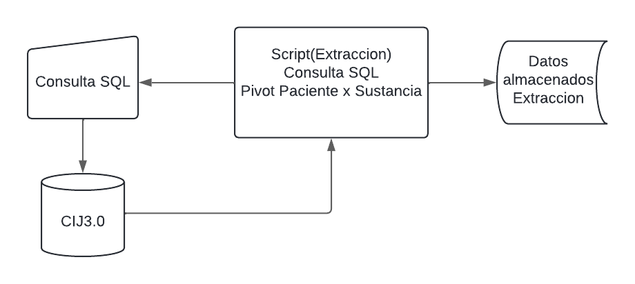

# Proyecto-CIJ
### *Introduccion*
Centros de Integración Juvenil (CIJ) es una asociación civil mexicana, no lucrativa, incorporada al Sector Salud, que cuenta con más de 50 años de experiencia en la prevención, tratamiento y rehabilitación de las conductas adictivas y otros problemas de salud mental. El proyecto se basa en crear una visualizacion (En este repositorio se encuentra la parte de backend) de reportes que contendran tendencias y perfiles asociados al consumo de sustancias tanto ilegales como legales. El desarrollo del proyecto se realizo en python.

### *Extraccion*
La extracción es la primera fase del proceso ETL (Extract, Transform, Load), que se encarga de recopilar datos de diferentes sistemas fuente, como bases de datos relacionales (RDBMS) o sistemas de archivo. En esta fase, se extraen los datos necesarios para su posterior transformación y carga en un almacén de datos de destino.
En esta parte se desarrollo la conexion a una base de datos utilizando la libreria pyodbc , esta libreria fue buscada y encontrada en https://github.com/mkleehammer/pyodbc.wiki.git sin embargo no pude encontrar la manera de citarlos.
Posterior a conectarse a nuestro servidor se realizo una consulta donde extraemos las tablas que necesitamos para nuestro proyecto, el problema que se presenta es que un paciente puede registrar cualquier cantidad de sustancias como haya consumida en su vida, actualmente nosotros contamos con 83 sustancias y 1 relacionada a enfermedades mentales. Tenemos una tabla que guardas los datos personales de los pacientes y otra donde guardamos los registros por sustancias, entonces al hacer el join de estas sustancias por la variable FolioId (identificador unico) se duplicaban exponencialmente los folios. Para resolver este problema se realizo un script el cual agrupa a las variables que eran diferentes y asi poder realizar un pivote seguro sin tener que perder informacion.
[text](README.md) 

### *Codigo Extraccion*
#### Proceso de consulta
##### *Librerias*
``
import pyodbc
from sqlalchemy import create_engine
from dotenv import load_dotenv
import os
import pandas as pd
import warnings
import re
``
##### *Proceso de obtencion de datos DB*
``
def get_dataconn():
    """
    Descripcion:
    Funcion que crea una conexion a la base de datos de SQL Server
    Retorna:
    connection: Conexion a la base de datos de SQL Server
    """
    load_dotenv()
    server = os.getenv('DB_SERVER')
    database = os.getenv('DB_DATABASE')
    username = os.getenv('DB_USER')
    password = os.getenv('DB_PASSWORD')
    connection_string = f'DRIVER={{ODBC Driver 17 for SQL Server}};SERVER={server};DATABASE={database};UID={username};PWD={password}'
    return connection_string
``

##### *Funciones*
``
def read_consult():
    """
    Descripcion:
    Funcion que lee el archivo consult.sql y retorna el contenido del archivo
    Retorna:
    consult: Contenido del archivo consult.sql
    """
    with open ('consults/consult.sql', 'r') as file:
        consult = file.read()
    return consult
``
``
def get_dataset(connection_string):
    """
    Descripcion:
    Funcion que realiza una consulta a la base de datos de SQL Server y retorna un DataFrame con los resultados
    Retorna:
    df: DataFrame con los resultados de la consulta
    """
    try:
        conn = pyodbc.connect(connection_string)
        cursor = conn.cursor()
        query = read_consult()
        df = pd.read_sql_query(query, conn)
        return df
    except Exception as e:
        print(f'Error: {e}')
        exit()
``

#### Proceso de pivot
##### *Funciones de grupos*
``
def groupFolioSustancia(df):
    """
    Descripción:
    Esta función agrupa por FolioId y SustanciaId y regresa una lista de los valores de las columnas agrupadas. 
    Parametros:
    df: DataFrame de pandas
    Return:
    grupo: DataFrame de pandas agrupado por FolioId y SustanciaId
    """
    grupo = df.groupby(["FolioId" , "SustanciaId"]).agg(list).reset_index()
    return grupo
``    
``
def groupFolioMotivo(df):
    """
    Descripción:
    Esta función agrupa por FolioId y MotivoConsultaId y regresa una lista de los valores de las columnas agrupadas.
    Parametros:
    df: DataFrame de pandas
    Return:
    grupo: DataFrame de pandas agrupado por FolioId y MotivoConsultaId
    """
    grupo = df.groupby(["FolioId" , "MotivoConsultaId"]).agg(list).reset_index()
    return grupo
``
##### *Proceso de modificacion*
``
def procesar (grupo , list_columns):
    """
    Descripción:
    Esta función procesa las columnas de un DataFrame de pandas agrupado por FolioId y SustanciaId o MotivoConsultaId.
    Parametros:
    grupo: DataFrame de pandas 
    list_columns: lista de columnas a procesar
    Return:
    grupo: DataFrame de pandas procesado
    """
    for i in range (0 , len(grupo.index)):
        for col in list_columns:
            if len(grupo[col][i]) > 1:
                grupo[col][i] = grupo[col][i][0]
    return grupo
``
``
def modif (grupo):
    """
    Descripción:
    Esta función modifica las columnas de un DataFrame de pandas agrupado por FolioId y SustanciaId o MotivoConsultaId.
    Parametros:
    grupo: DataFrame de pandas
    Return:
    grupo: DataFrame de pandas modificado
    """
    
    list_columns = ["EntrevistaInicialSustanciaId" , "EdadInicio" , "OrdenConsumo" , "ComunPrimeraFormaAdministracionId" , "ComunSegundaFormaAdministracionId" , "ComunTerceraFormaAdministracionId" , "ComunAbstinenciaId" , "ComunUltimoConsumoId" , "Dosis"]
    grupo_pro = procesar(grupo,list_columns)
    return grupo_pro
``
``
def modif2 (grupo):
    """
    Descripción:
    Esta función modifica las columnas de un DataFrame de pandas agrupado por FolioId y MotivoConsultaId.
    Parametros:
    grupo: DataFrame de pandas
    Return:
    grupo: DataFrame de pandas modificado
    """
    list_columns = ["MotivoConsultaId"]
    grupo_pro = procesar(grupo,list_columns)
    return grupo_pro
``
##### *Proceso de Limpieza*
``
def drop_rows (group_sep):
    """
    Descripción:
    Esta función elimina las filas duplicadas de un DataFrame de pandas agrupado por FolioId y SustanciaId.
    Parametros:
    group_sep: DataFrame de pandas
    Return:
    group_sep: DataFrame de pandas sin filas duplicadas
    """
    group_sep.drop_duplicates( subset = "FolioId" , keep = "first" , inplace = True)
    return group_sep
``
``
def piv (grupo_mod , list_columns):
    """
    Descripción:
    Esta función realiza una tabla pivote de un DataFrame de pandas agrupado por FolioId y SustanciaId.
    Parametros:
    grupo_mod: DataFrame de pandas
    list_columns: lista de columnas a procesar
    Return:
    df_complete: DataFrame de pandas con tabla pivote
    """
    
    df_complete = pd.DataFrame()
    for valor , group_sep in grupo_mod.groupby("FolioId"):
        for i in range(len(group_sep.index)):
            for col in list_columns:
                if i != 0 :
                    aux_name_col = col + str(i)
                    if aux_name_col not in group_sep.columns:
                        group_sep[aux_name_col] = np.nan
                    group_sep[aux_name_col] = group_sep[col].iloc[i]
        df_complete = pd.concat([df_complete, group_sep])
    return df_complete
``
``
def extract (x):
    """
    Descripción:
    Esta función extrae el primer elemento de una lista.
    Parametros:
    x: lista
    Return:
    x[0]: primer elemento de la lista
    """

    if isinstance(x , list):
        return x[0] if len(x) > 0 else None
    return x
``
``
def trat (df_completemerge):
    """
    Descripción:
    Esta función aplica la función extract a todas las columnas de un DataFrame de pandas.
    Parametros:
    df_completemerge: DataFrame de pandas
    """
    
    for col in df_completemerge.columns:
        df_completemerge[col] = df_completemerge[col].apply(extract)
``
``
def busqueda_Folio( df_completemerge, val_folio , ind_folio):
    """
    Descripción:
    Esta función busca el índice de un valor en una columna de un DataFrame de pandas.
    Parametros:
    df_completemerge: DataFrame de pandas
    val_folio: valor a buscar
    ind_folio: índice a buscar
    Return:
    ind: índice del valor en la columna
    """
    
    for ind , val in df_completemerge["FolioId"].items():
        if val == val_folio and ind != ind_folio:
            return ind
``
``
def AcomDa (df_completemerge , ind , ind_igual):
    """
    Descripción:
    Esta función acomoda los valores de un DataFrame de pandas.
    Parametros:
    df_completemerge: DataFrame de pandas
    ind: índice a acomodar
    ind_igual: índice a acomodar
    Return:
    df_completemerge: DataFrame de pandas acomodado
    """
    
    if ind_igual == None:
        return df_completemerge
    else:
        for col in df_completemerge.columns:
            valor_1 = df_completemerge[col].iloc[ind]
            valor_2 = df_completemerge[col].iloc[ind_igual]
            if pd.isna(valor_1) and pd.notna(valor_2):
                df_completemerge[col].iloc[ind] = valor_2
            elif pd.notna(valor_1) and pd.isna(valor_2):
                df_completemerge[col].iloc[ind_igual] = valor_1
        return df_completemerge
``
``
def limp (df_completemerge):
    """
    Descripción:
    Esta función elimina los valores duplicados de un DataFrame de pandas.
    Parametros:
    df_completemerge: DataFrame de pandas
    Return:
    df_new: DataFrame de pandas sin valores duplicados
    """
    
    for ind , val in df_completemerge["FolioId"].items():
        ind_igual = busqueda_Folio(df_completemerge , val , ind)
        df_new = AcomDa(df_completemerge , ind , ind_igual)
    df_new.drop_duplicates(inplace = True)
    return df_new
``
##### *main*
``
def main(df):
    """
    Descripción:
    Esta función aplica todas las funciones anteriores para procesar un DataFrame de pandas.
    Parametros:
    df: DataFrame de pandas
    Return:
    df_complete: DataFrame de pandas procesado
    """
    warnings.filterwarnings("ignore")
    grupo = groupFolioSustancia(df)
    grupo_mod = modif(grupo)
    list_columns = ["SustanciaId" , "EntrevistaInicialSustanciaId" , "EdadInicio" , "OrdenConsumo" , "ComunPrimeraFormaAdministracionId" , "ComunSegundaFormaAdministracionId" , "ComunTerceraFormaAdministracionId" , "ComunAbstinenciaId" , "ComunUltimoConsumoId" , "Dosis"]
    trat(grupo_mod)
    df_complete = piv(grupo_mod,list_columns)
    df_complete = limp(df_complete)
    drop_rows(df_complete)

    grupo2 = groupFolioMotivo(df)
    trat(grupo2)
    list_columns = ["MotivoConsultaId"]
    df_complete2 = piv(grupo2,list_columns)
    df_complete2 = limp(df_complete2)
    drop_rows(df_complete2)
    
    df_complete = pd.concat([df_complete, df_complete2], ignore_index=True)
    trat(df_complete)
    df_complete = limp(df_complete)
    drop_rows(df_complete)
    return df_complete
``
``
connection_string = get_dataconn()
df = get_dataset(connection_string)
df.to_csv('dataset/SQLEntrevistaInicial.csv', index = False)
warnings.filterwarnings("ignore")
df_final = pd.DataFrame()
chunksize = 100000
for chunk in pd.read_csv("dataset/SQLEntrevistaInicial.csv", chunksize = chunksize):
    df = chunk
    df = main(df)
    df_final = pd.concat([df_final, df], ignore_index = True)
df_final.to_csv('results/EntrevistaInicial.csv', index = False)
``

